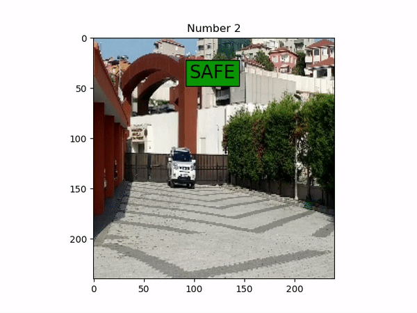
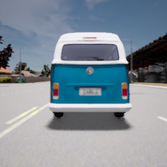
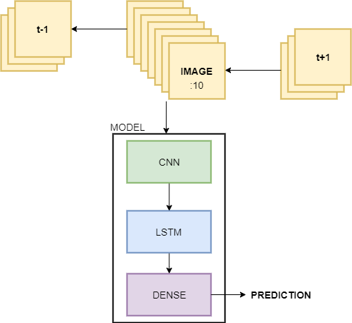
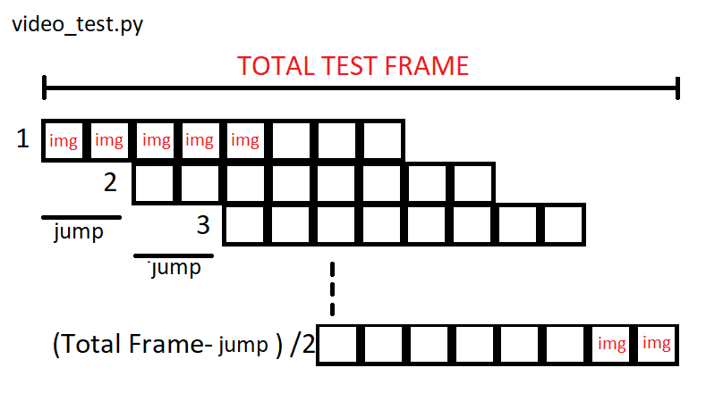

# SEQUENCE LEARNING for Beginners
# Motorcyclist Safety System with AI 

This project has developed to put an approach to avoid deadly motorcycle accidents. Everyday, due to the motor accidents, thousands of people die or get disabled. 
These accidents are happening from both the carelessness of the bikers and the carelessness of the drivers. 

Although, We all know that motorcyclists are much more vulnerable to getting an impact from an accident, !Companies still don't put the enough afford to decrease the numbers.   
# We hope to give companies a good starting point

* The model will be tested on RPi with real time images. Pls keep tuned :)

   
   

# My Setup:
* Nvidia Gtx1070ti
* 4x8gb 3000Mhz memory
* Sata ssd
* i7 8700k

# 1. Collecting Training DATA

* Carla(0.9.9.4) has been used to get training and test scenarios. The trained model will be tested on real-life records.
  - To increase the randomness of scenarios, vehicles(except motorcycle) and weather were changed randomly. Of course, dark and foggy sky scenarios haven't used.  
  - Image size has determined as 240x240 and field of view as 60 degrees. The reason for the image size is obviously to increase the number of scenarios that can be computed on ram at once. Optimization will always enhance your model from a couple of aspects (e.g faster array computation that would have been restricted by virtual ram). 
  - Of course, this is a project of sequence learning, so the length of the scenarios is important and it is chosen as 8, which is also the batch size.
  - There are two cameras located on a motorcycle and four major scenarios, rear_crash, rear_safe, front_crash, front_safe. Front and rear camera data have trained seperately. 
  - Custom code to generate training and test data can be found in codes_carla folder. bela and bela2 are for rear camera and bela3 and bela4 are for front camera data.
  - Besides, The test code on the simulation is located in codes_carla folder with the name manual_control_predicted.py. the trained_model path should be changed before begin. This test requires a vehicle with camera located at behind. This vehicle can be created by auto_motor.py, that create an autonomous motorcycle. To run this code you have to get in and change the path of the saving directory. And also use the same directory in manual_control_predicted.py. I know it looks kind of complicated, but I will add a gif showing the steps one by one.  

# 2. Creating Model 

* There are three main jobs that model has to handle with, feature extraction, creating time dependency and finding weights.
  - Each scenario has to be fed into the model without being messed up with others, at the same time, scenarios should be shuffled at each epoch to decrease overfitting and to increase randomness. 
  - For beginners:
    - CNN is used, so that features of images can be extracted well.  
    - LSTM is used, so that sequence learning can be done. LSTM is a RNN algorithm, that eliminates the long-term depency. 
    - Dense layer is used to increase the complexity and the number of the weight. Output neuron number has a crucial importance here. It can be selected by a simple hyperparametre optimizer, I will share mine as soon as possible.
    - Droupout layers are used to get rid of overfitting.
 

# 3. Real-life Test

* Before testing on a live camera fastened on a motorcycle, I took dummy test videos like in the gifs at the beginning. First, I took video, then increased the speed on Adobe Premiere, then ran video_test.py(you can give a look at this code in codes folder), that takes the given video and pulls the frames to predict through the trained_model.h5. It labels each frame, and saves it. Again I used premiere to save the sequence of frames as video.   
